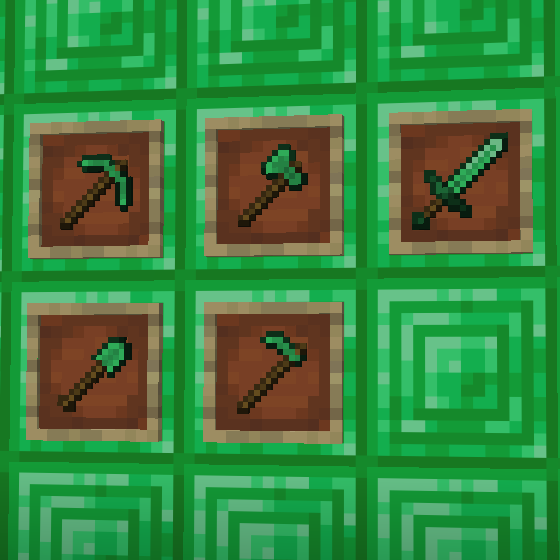

# Emerald Tools

A [Minecraft](minecraft.net) mod built on [Fabric](fabricmc.net).

With this mod you can craft the following tools with emerald blocks: Axe, Hoe, Pickaxe, Shovel, and Sword.

Emerald tools are comparable to diamond with the following exceptions;

1. [Durability](https://minecraft.fandom.com/wiki/Durability#Item_durability): 1717
1. [Mining Speed](https://minecraft.gamepedia.com/Breaking#Speed): 9
1. [Enchantability](https://minecraft.gamepedia.com/Enchanting/Mechanics#Enchantability): 20
1. Attack Damage: +0.5