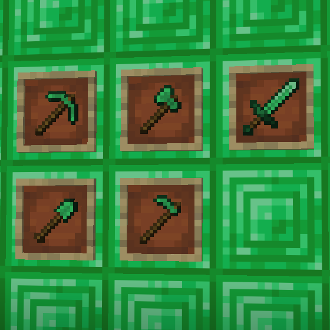

# Emerald Tools

A Fabric mod that adds tools made from emerald blocks.

## Features

Craft pickaxe, axe, shovel, hoe, and sword from emerald blocks. Emerald tools are comparable to diamond with some differences.

### Tool Stats

| Stat | Emerald | Diamond |
|------|---------|---------|
| Durability | 1717 | 1561 |
| Mining Speed | 9.0 | 8.0 |
| Attack Damage Bonus | +3.5 | +3.0 |
| Enchantability | 20 | 10 |

**Highlights:**
- Higher durability than diamond
- Faster mining speed
- More damage
- Double the enchantability
- Crafted from emerald blocks (expensive but renewable via villager trading)

## Screenshots

## Crafting

Standard tool crafting patterns using **Emerald Blocks** and sticks.

## Pandorical

Emerald Tools uses Pandorical to sync its custom item assets (textures) to clients. Pandorical is required on both the server and every client; there is no vanilla-client fallback. Tool stats and functionality are unaffected either way; Pandorical governs only how the tools are rendered.

## Development

Installing is in [DEVELOPMENT.md](DEVELOPMENT.md).

## License

MIT, see [LICENSE](LICENSE).
